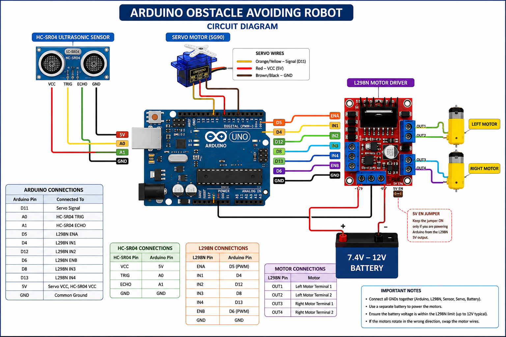

# 🤖 Arduino Obstacle Avoiding Robot

> An Arduino-based autonomous obstacle avoiding robot that uses an HC-SR04 ultrasonic sensor, SG90 servo motor, and L298N motor driver to detect obstacles and navigate around them.

<p align="center">


</p>

---

# 📖 Overview

This repository contains an Arduino-based obstacle avoiding robot that autonomously detects and avoids obstacles using an HC-SR04 ultrasonic sensor mounted on an SG90 servo motor. The robot continuously measures the distance to nearby objects while moving forward. When an obstacle is detected within a predefined distance, it stops, scans both the left and right directions, compares the available space, and automatically turns toward the clearer path before continuing its movement.

This project demonstrates the integration of embedded systems, ultrasonic sensing, servo control, DC motor control, and autonomous navigation using the Arduino platform.

---

# 📷 Circuit Diagram

<p align="center">
    
</p>

> Circuit diagram of the Arduino-based obstacle avoiding robot.

---

# ✨ Features

- Autonomous obstacle detection
- Automatic obstacle avoidance
- Real-time distance measurement
- Servo-based environmental scanning
- Intelligent left/right path selection
- Differential drive using two DC motors
- PWM motor speed control
- Lightweight navigation algorithm
- Arduino-based implementation

---

# 🛠 Hardware Components

| Component | Quantity |
|-----------|---------:|
| Arduino Uno | 1 |
| HC-SR04 Ultrasonic Sensor | 1 |
| SG90 Servo Motor | 1 |
| L298N Motor Driver Module | 1 |
| DC Gear Motors | 2 |
| Robot Chassis | 1 |
| Wheels | 2 |
| Battery Pack (7.4V–12V Recommended) | 1 |
| Jumper Wires | As Required |

---

# 💻 Software Requirements

- Arduino IDE
- Arduino Servo Library
- C++

---

# 🧠 Working Principle

```text
Start
   │
   ▼
Move Forward
   │
   ▼
Measure Distance
   │
   ├───────────────┐
   │               │
Obstacle?        No Obstacle
   │               │
  Yes              ▼
   │         Continue Moving
   ▼
Stop
   │
   ▼
Scan Left
   │
   ▼
Measure Distance
   │
   ▼
Scan Right
   │
   ▼
Measure Distance
   │
   ▼
Compare Distances
   │
   ├───────────────┐
   │               │
Left Clear      Right Clear
   │               │
   ▼               ▼
Turn Left     Turn Right
   │
   ▼
Continue Forward
```

---

# 🔌 Circuit Connections

## Arduino → HC-SR04

| Arduino | HC-SR04 |
|----------|----------|
| 5V | VCC |
| GND | GND |
| A0 | TRIG |
| A1 | ECHO |

## Arduino → Servo Motor

| Arduino | Servo |
|----------|--------|
| D11 | Signal |
| 5V | VCC |
| GND | GND |

## Arduino → L298N Motor Driver

| Arduino | L298N |
|----------|--------|
| D5 | ENA |
| D4 | IN1 |
| D12 | IN2 |
| D6 | ENB |
| D8 | IN3 |
| D13 | IN4 |
| GND | GND |

## L298N → Motors

| L298N | Motor |
|--------|--------|
| OUT1 | Left Motor |
| OUT2 | Left Motor |
| OUT3 | Right Motor |
| OUT4 | Right Motor |

---

# 📁 Repository Structure

```text
obstacle-avoiding-robot
│
├── Obstacle_Avoiding_Robot.ino
├── diagram.png
└── README.md
```

---

# 🚀 Getting Started

1. Clone the repository.

```bash
git clone https://github.com/Md-Abdullah-Al-Afif/obstacle-avoiding-robot.git
```

2. Open `Obstacle_Avoiding_Robot.ino` using the Arduino IDE.
3. Install the **Servo** library if it is not already installed.
4. Assemble the hardware according to the provided circuit diagram.
5. Upload the code to the Arduino Uno.
6. Power the robot using a suitable battery pack.
7. Place the robot on a flat surface and observe its autonomous obstacle avoidance behaviour.

---

# 📚 Technologies Used

- Arduino Uno
- Embedded C++
- Arduino IDE
- HC-SR04 Ultrasonic Sensor
- SG90 Servo Motor
- L298N Motor Driver
- DC Gear Motors
- PWM Motor Control

---

# 🎯 Learning Outcomes

This project demonstrates practical knowledge and experience in:

- Embedded Systems
- Arduino Programming
- Robotics
- Sensor Integration
- Ultrasonic Distance Measurement
- Servo Motor Control
- DC Motor Control
- PWM Speed Control
- Autonomous Navigation
- Obstacle Avoidance Algorithms
- Hardware Integration

---

# 🚀 Future Improvements

Potential enhancements include:

- Bluetooth remote control
- Wi-Fi connectivity
- Mobile application integration
- Voice command support
- Line following capability
- Camera-based navigation
- Object recognition using computer vision
- LiDAR integration
- SLAM (Simultaneous Localization and Mapping)
- Dynamic path planning
- Battery monitoring and power management

---

# ⚠️ Disclaimer

This project is intended for learning, experimentation, and demonstration purposes. Hardware configurations may vary depending on the components used. Always verify wiring connections before powering the circuit.

---

# ⭐ Support

If you found this project useful, consider giving the repository a **⭐ Star**.
